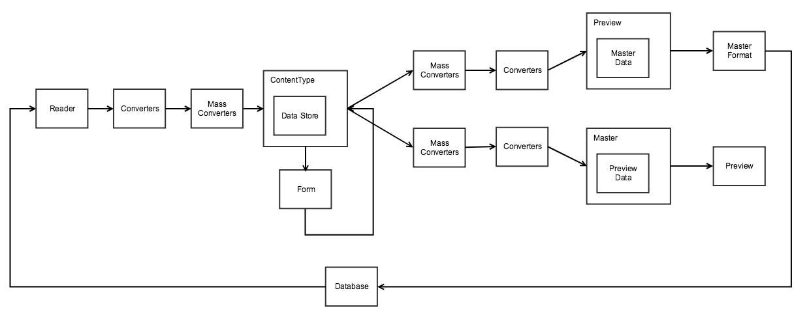

# Architecture overview

## What is Page Builder?

PageBuilder is tool that simplifies content creation. It allows to grag and drop content types and configure them. Changes are immediately displayed in the preview in admin and it matches to what user will see on the storefront.

## What is Page Builder?

PageBuilder is tool that simplifies content creation. It allows to grag and drop content types and configure them. Changes are immediately displayed in the preview in admin and it matches to what user will see on the storefront.

## Technologies

Page Builder written in TypeScript, however it comes with compiled JavaScript. You don't need to worry about compiling TypeScript or use it TypeScript your module.

Page Builder also uses Knockout.js, UI components for building forms and different libraries like slick.

## Storage format 

For storage (later master format) Page Builder uses XHTML with inline styles and data attributes. The idea is that is that content can be displayed with minimum changes on Magento storefront and also by third party systems.

To display Page Builder content on storefront Magento and third party systems need to do the following

1. Replace Magento directives (for instance {{image url=path/to/image.png}}).
2. Add custom stylesheet.
3. After content is rendered, on the frontend find all of content types that need to have widgets initialized (for instance, slider, tabs, etc) and load and initialize these widgets.

See more on [master format](master-format.md)

## Integration with Magento and custom modules

PageBuilder replaces WYSIWYG on all forms. You can enable/disable Page Builder for product attributes.

Page Builder also would be enabled in custom extensions where WYSIWYG is used.

## Big picture

| Entity            | Name in configuration | Description                                                                                                    |
| ----------------- | --------------------- | -------------------------------------------------------------------------------------------------------------- |
| Content type      | `component`           | View model responsible for rendering the preview and master format                                             |
| Preview component | `preview_component`   | Contains preview specific logic that is generic for all appearances. Preview component is optional             |
| Master component  | `content_component`   | Contains master format rendering logic that is generic for all appearances. Content component is optional      |
| Data Store        |                       | Contains data for the content type                                                                             |
| Appearance        | `appearance`          | Configuration for content type that defines look and behavior. Includes data mapping, form, templates, reader. |
| Preview template  | `preview_template`    | Template used to display the element in the preview                                                            |
| Master template   | `master_template`     | Template used to render the content type to the master format                                                  |
| Form              | `form`                | Form that will be used to edit content type                                                                    |
| Reader            | `reader`              | Reads data for the content type from the master format                                                         |

## Data flow

Here is simplified data flow:
1. Data read by reader `Magento_PageBuilder/js/master-format/read/configurable`.
2. Data for each element (`border`, `border_color`, `border_width` etc) converted to internal format.
3. Data converted by mass converters, for more details see [converter interface](content-type-configuration.md).
4. Content type created and `Magento_PageBuilder/js/data-store` populated with data.
5. Data in data store modified and updated in data store.
6. Data converted by mass converters.
7. Converted by element converters.
8. Preview and master component observables updated.
9. Attribute that editable with Page Builder updated, master format hen user saves pages data saved to the database.

## Data store

Data for content type stored in DataStore `Magento_PageBuilder/js/data-store`.

DataStore is a simple object. `var` from [content type configuration](content-type-configuration.md) is the name of parameter in DataStore.

You can use `subscribe` method to subscribe to changes of the data and perform custom action on it.

## Content type configuration

Please see [content type configuration](content-type-configuration.md#Converter Interfaces) for content type configuration.

## Appearances

Appearances allow to customize existing content types.

Appearance allows to make the following customizations to content type:
1. Add new style properties to existing content types.
2. Add new attributes to existing content types. This is similar to above.
3. Change templates
4. Move data between elements, achieved with data mapping configuration. For example, developer can move margin from one element to another.
5. Change form for content type.

## Module structure

| File type                | Location                                                                                       |
| -------------------------|------------------------------------------------------------------------------------------------|
| Content type components  | `Vendor/ModuleName/view/adminhtml/web/js/content-type/content-type-name`                       |
| Content type templates   | `Vendor/ModuleName/view/adminhtml/web/template/content-type/content-type-name/appearance-name` |
| Styles                   | `Vendor/ModuleName/view/adminhtml/web/css/source/content-type/content-type-name`               |

**Note:**
*We also considering introducing appearance component and/or moving initialization of the libraries to bindings. This would allow add custom logic per appearance changes libraries per appearance for content types like slider, tabs, accordion, etc.*
