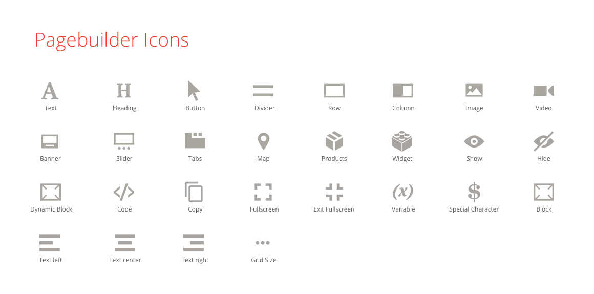

# Iconography

## Navigation

1. [Introduction]
2. [Installation guide]
3. [Contribution guide]
4. [Developer documentation]
    1. [Architecture overview]
    1. [BlueFoot to PageBuilder data migration]
    1. [Third-party content type migration]
    1. **Iconography**
    1. [Add image uploader to content type]
    1. [Module integration]
    1. [Additional data configuration]
    1. [Content type configuration]
    1. [How to add a new content type]
    1. [Events]
    1. [Bindings]
    1. [Master format]
    1. [Visual select] 
    1. [Reuse product conditions in content types]
    1. [Store component master format as widget directive]
    1. [Use the block chooser UI component]
    1. [Render a backend content type preview]
    1. [Custom Toolbar]
    1. [Full width page layouts]
5. [Roadmap and known issues]
6. [Creating custom content block]
7. [How to create custom PageBuilder content type container]

[Introduction]: README.md
[Contribution guide]: CONTRIBUTING.md
[Installation guide]: install.md
[Developer documentation]: developer-documentation.md
[Architecture overview]: architecture-overview.md
[BlueFoot to PageBuilder data migration]: bluefoot-data-migration.md
[Third-party content type migration]: new-content-type-example.md
[Iconography]: iconography.md
[Add image uploader to content type]: image-uploader.md
[Module integration]: module-integration.md
[Additional data configuration]: custom-configuration.md
[Content type configuration]: content-type-configuration.md
[How to add a new content type]: how-to-add-new-content-type.md
[Events]: events.md
[Bindings]: bindings.md
[Master format]: master-format.md
[Visual select]: visual-select.md
[Reuse product conditions in content types]: product-conditions.md
[Store component master format as widget directive]: widget-directive.md
[Render a backend content type preview]: content-type-preview.md
[Use the block chooser UI component]: block-chooser-component.md
[Custom Toolbar]: toolbar.md
[Full width page layouts]: full-width-page-layouts.md
[Add image uploader to content type]: image-uploader.md
[Roadmap and Known Issues]: roadmap.md
[Creating Custom Content Block]: creating-custom-content-block.md
[How to create custom PageBuilder content type container]: how-to-create-custom-pagebuilder-content-type-container.md

## Overview

PageBuilder Admin icons follow the same design principles as the core [Magento Admin icons].
They are simple, flat, and monochromatic to prevent the loss of detail at smaller sizes and makes the shapes easier to comprehend.

## Icon library
The following image shows all available PageBuilder Admin icons:

You can use these icons when extending or customizing the PageBuilder module or [create your own icons].

## Icon fonts
We recommend using icon fonts to get the best quality for your icons. 
The PageBuilder Admin icon fonts can be found in the [cms-icons repository].

If you want to add your own icons, each icon will need to be in its own SVG files. There are multiple ways to create icon fonts, here is one to get started:

1. Go to <a href="https://icomoon.io/app/" target="\_blank"> https://icomoon.io/app/ </a> or download this app in Chrome web store.  

2. Upload your icons in SVG format into the app.

3. Specify desired font names and specify the Unicode characters to map the icons. Setting the icons to Private User Area will disable screen-readers or other accessibility tools to read your icon's characters (read "Unicode" section here).

4. Then initialize a download in the app to generate the icon font and CSS style sheet.

[Magento Admin icons]: https://devdocs.magento.com/guides/v2.2/pattern-library/graphics/iconography/iconography.html
[create your own icons]: https://devdocs.magento.com/guides/v2.2/pattern-library/graphics/iconography/iconography.html#creating-icons
[cms-icons repository]: https://github.com/magento-ux/cms-icons
